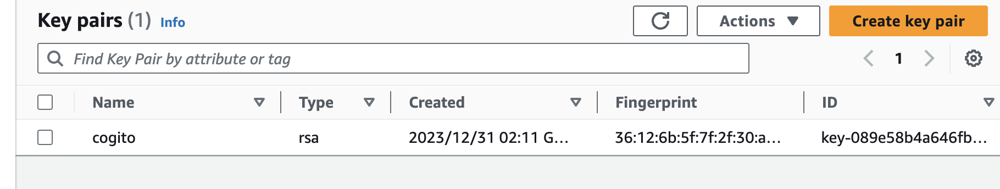
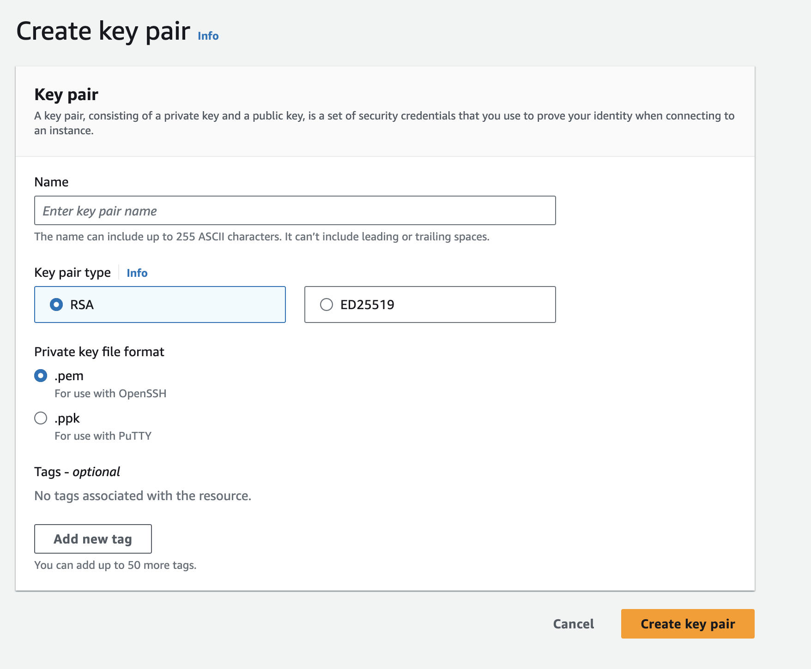
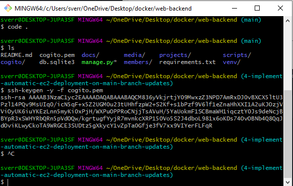
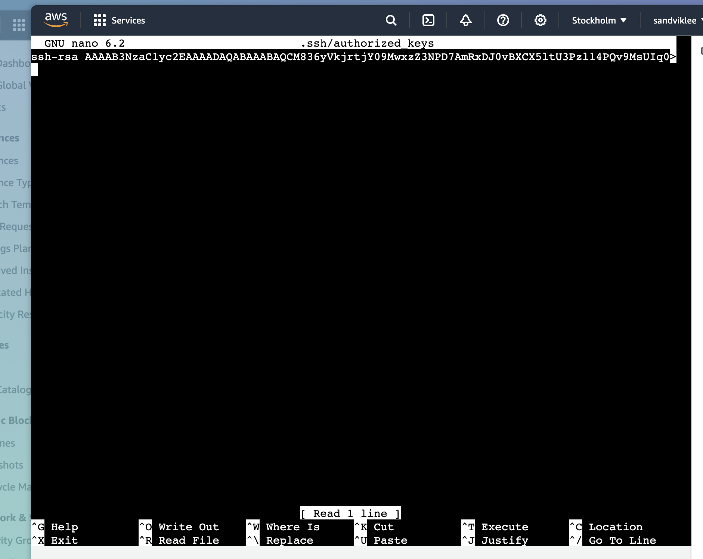
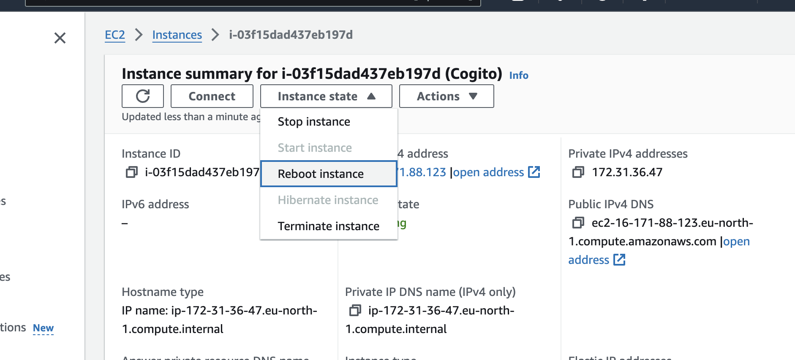

# How to create the SSH key pair

## Create the key pair [Read more](https://linux.how2shout.com/add-a-new-key-pair-to-your-exisitng-aws-ec2-instances/)
Go into key pairs in the EC2 dashboard and create a new key pair. Download the .pem file and save it in the root of the project.


Will automatically download a Private key

Connect to the instance through AWS Instance Connect
Now to connect key pairs to the EC2 instance, we need to add the Public key
Write this and get the public key
```bash
ssh-keygen -y -f /path_to_downloaded_key-pair.pem
```
You will get a public key like this:



```bash
sudo nano .ssh/authorized_keys
```
Now we need to add the public key into the EC2 instance, which we got running on the website through the AWS Instance connect terminal



Now we need to reboot the EC2 Instance:


## Connect to the EC2 instance remotely [Read more](https://www.how2shout.com/linux/how-to-ssh-aws-ec2-linux-instances-remotely/)
We now need the private key to connect, so write this in your terminal
```bash
chmod 400 /path_to_downloaded_key-pair.pem
```

You can now connect to the Ubuntu instance, by writing this:
```bash
ssh -i "/path_to_downloaded_key-pair.pem" ubuntu@ec2-16-171-88-123.eu-north-1.compute.amazonaws.com
```
