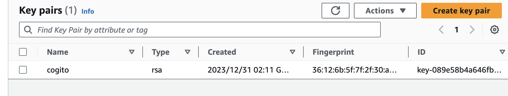
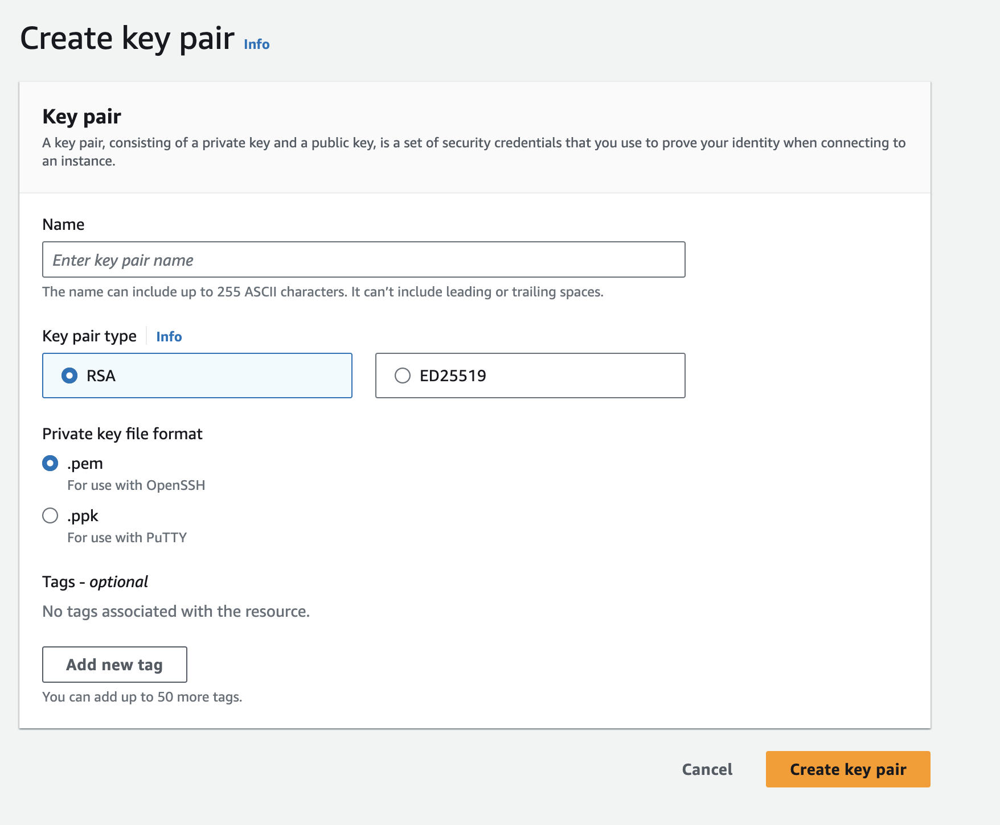
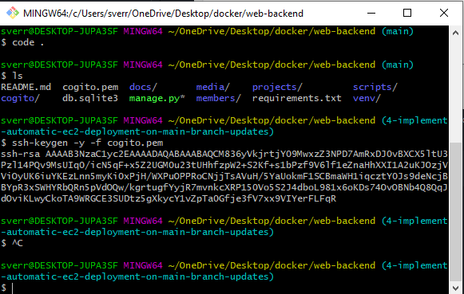
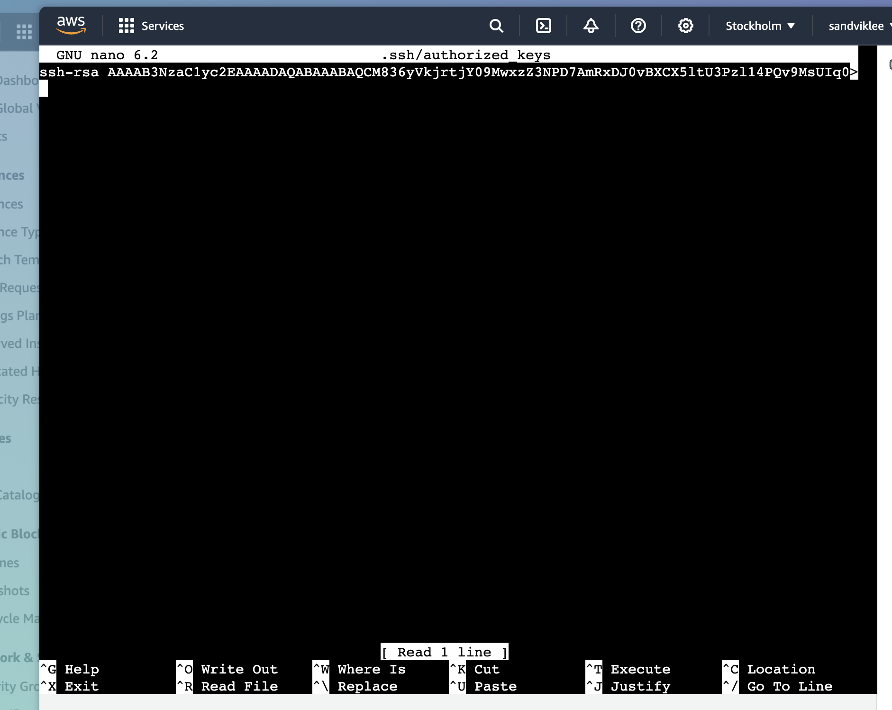
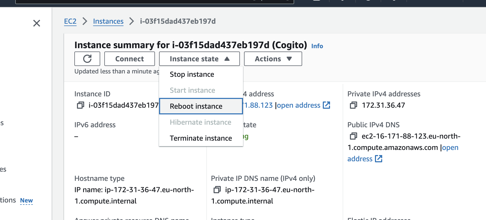

# How to Create an SSH Key Pair for AWS EC2
This guide provides steps to create an SSH key pair for AWS EC2 instances, facilitating secure remote connections.

Table of Contents
=================
<details>
<summary><b>Table of Contents</b></summary>

- [How to Create an SSH Key Pair for AWS EC2](#how-to-create-an-ssh-key-pair-for-aws-ec2)
- [Table of Contents](#table-of-contents)
  - [Prerequisites](#prerequisites)
  - [Steps to Create and Use the SSH Key Pair](#steps-to-create-and-use-the-ssh-key-pair)
    - [1. Generating the Key Pair Read more](#1-generating-the-key-pair-read-more)
    - [2. Extracting the Public Key](#2-extracting-the-public-key)
    - [3. Adding the Public Key to the EC2 Instance](#3-adding-the-public-key-to-the-ec2-instance)
    - [4. Rebooting the EC2 Instance|](#4-rebooting-the-ec2-instance)
    - [5. Connect to the EC2 instance remotely Read more](#5-connect-to-the-ec2-instance-remotely-read-more)
    - [TMUX](#tmux)
</details>

## Prerequisites
- An active AWS account.
- Access to AWS EC2 dashboard.

## Steps to Create and Use the SSH Key Pair
### 1. Generating the Key Pair [Read more](https://linux.how2shout.com/add-a-new-key-pair-to-your-exisitng-aws-ec2-instances/)
We will be using the AWS EC2 dashboard to generate the key pair. This key is needed to connect to the EC2. Follow the steps below to generate the key pair:
- Navigate to the EC2 dashboard.
- Select "Key Pairs" under the "Network & Security" section.
- Click "Create key pair".

- Name your key pair and download the `.pem` file. 

The key will automatically download a Private key
- Save the `.pem` file in the root of your project. 

### 2. Extracting the Public Key
Now to connect key pairs to the EC2 instance, we need to add the Public key

Connect to the instance through AWS Instance Connect. Write this and get the public key
```bash
ssh-keygen -y -f /path_to_downloaded_key-pair.pem
```
You will get a public key like this:


### 3. Adding the Public Key to the EC2 Instance
Now we need to add the public key into the EC2 instance, which we got running on the website through the AWS Instance connect terminal (or through the terminal on your computer if you have connected to the instance before).

- Access your EC2 instance through the AWS Instance Connect.

- Open the authorized_keys file with:
    ```bash
    sudo nano .ssh/authorized_keys
    ```
- Append the public key you extracted earlier to this file.

### 4. Rebooting the EC2 Instance|
Now we need to reboot the EC2 Instance:


### 5. Connect to the EC2 instance remotely [Read more](https://www.how2shout.com/linux/how-to-ssh-aws-ec2-linux-instances-remotely/)
We now need the private key to connect, before connecting, adjust the permissions of your .pem file so it is readable:
```bash
chmod 400 /path_to_downloaded_key-pair.pem
```

You can now connect to the Ubuntu instance, by writing this:
```bash
ssh -i "/path_to_downloaded_key-pair.pem" ubuntu@ec2-16-171-88-123.eu-north-1.compute.amazonaws.com
```

```bash
ssh -i "drops-cogito.pem" root@ssh.cogito-ntnu.no
```

### TMUX
It is a terminal multiplexer. It allows you to run multiple terminal sessions in a single terminal window. It is very useful when you are working on a remote server via SSH. It allows you to keep a session active even when you disconnect from the server. You can reconnect to the session later and resume your work from where you left off.

The following link provides a cheat sheet for tmux: https://tmuxcheatsheet.com/